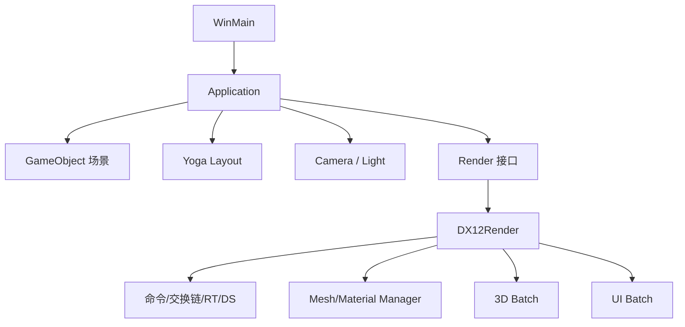

# 总体架构

Slot 是面向 Windows 的实时渲染框架。Win32 提供窗口和输入，Direct3D 12 是当前唯一实际后端，DirectXMath 处理变换，Yoga 计算 Flexbox UI 布局。

## 分层

| 层 | 职责 | 目录 |
| --- | --- | --- |
| 应用平台 | 窗口、消息、计时、应用编排 | `Core` |
| 场景表示 | 对象、变换、相机、灯光 | `UI/Object`、`UI/Light` |
| 资源表示 | Mesh、Material、Shader | `UI/Mesh`、`UI/Material`、`UI/Shader` |
| UI | Yoga 节点与 UI 渲染对象 | `UI/Layout` |
| 后端抽象 | `Init/Update/Draw/Resize` | `Target/Render.*` |
| D3D12 | GPU 资源、PSO、批次和提交 | `Target/DirectX` |

`Render::CreateRender` 当前始终创建 `DX12Render`，DirectX 11 和 Vulkan 枚举仅为预留。每个窗口拥有独立渲染器与交换链，`DX12Device` 的 Factory/Device 是进程级单例。

`Application` 与各注册表大量使用裸指针，尚无集中释放流程，实际资源生命周期接近进程生命周期。Mesh、Material、Shader 通过文件级静态对象注册，因此初始化顺序是重要约束。

每帧先由 Yoga 写入 UI 像素位置，再更新相机、全局常量和对象矩阵；3D/UI 数据分别进入两个批次，最后由 D3D12 提交并 Present。
