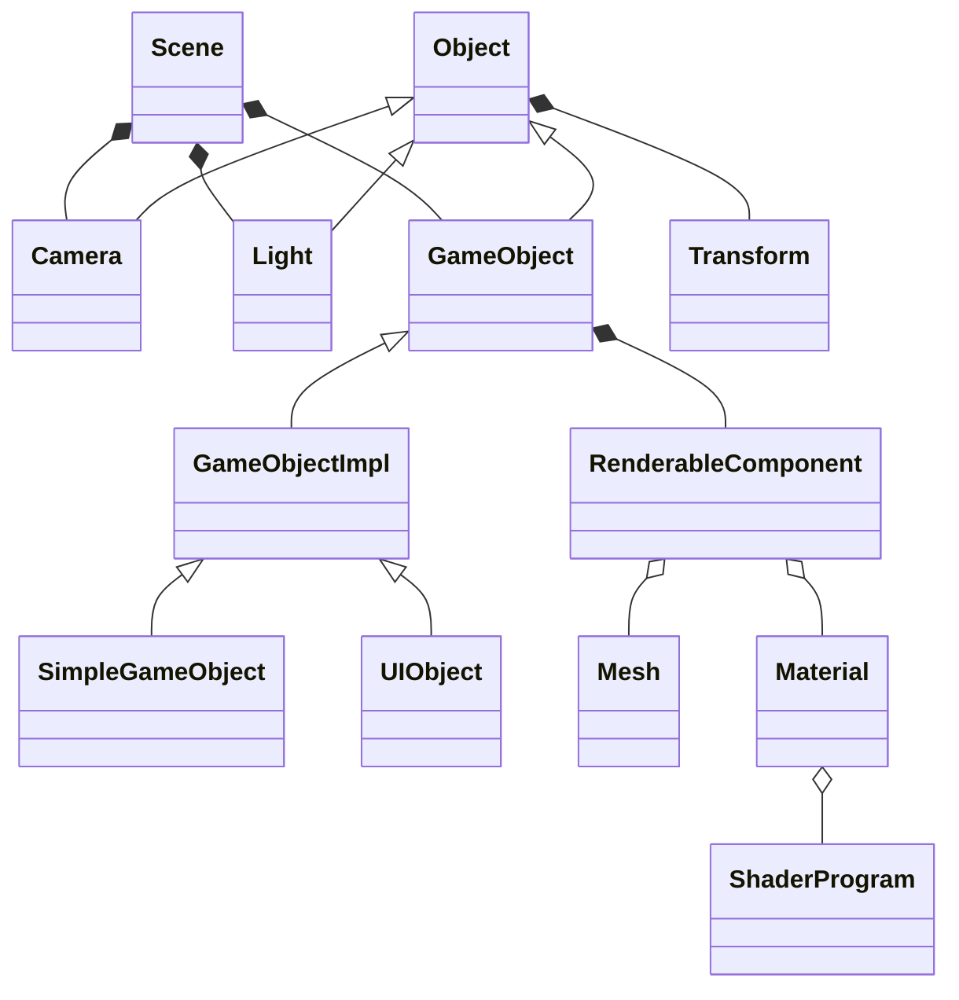

# 场景与对象

`Scene` 表示一个可独立装载和销毁的 3D 场景，统一拥有 Camera、主 Light 和 GameObject。`Object` 是带 `Transform`、更新函数和输入回调的基类；`GameObject` 通过 `RenderableComponent` 保存 Mesh 和 Material 的类型化软引用，Material 再选择 ShaderProgram。

## Transform

项目采用左手坐标系：+X 向右、+Y 向上、+Z 向屏幕内。世界矩阵计算为 `Scale * Rotation * Translation`。DirectXMath 矩阵写入 HLSL 常量前会转置；修改矩阵代码时必须同时核对 HLSL 的 `mul` 顺序。

Transform 还支持直角坐标与球坐标转换。

## 相机、灯光和碰撞

Camera 使用 `XMMatrixLookAtLH` 和 `XMMatrixPerspectiveFovLH`，默认 near/far 为 1/1000、FOV 120°。FirstPersonCamera 根据 yaw/pitch 更新目标方向，并将 pitch 限制在 ±89°。

ParallelLight 的位置、颜色、方向被写入全局常量，当前 Shader 只实现方向光。Collider 只有接口，BoxCollider 尚未实现，物理模块仍是骨架。

## 源码入口

- `include/Object/Object.h`
- `include/Scene/Scene.h`
- `src/Object/Transform.cpp`
- `include/Object/GameObject/GameObject.h`
- `src/Object/Camera`
- `include/Light`、`include/Phys`
