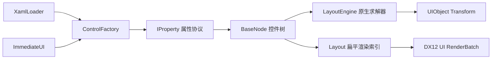

# UI 层架构

UI 层采用“多种声明前端 + 单一保留式控件树 + Slot 原生布局 + D3D12 渲染适配”的结构。XAML 与 ImGui 风格 API 不是两套控件系统：二者最终都生成 `BaseNode` 控件树，因此控件、布局规则和渲染行为保持一致。



## 控件树和所有权

`BaseNode` 只通过 `unique_ptr` 独占子节点，负责布局样式、计算几何、树关系、属性和裁剪传播；Root、Viewport、Content 等结构节点因此不携带交互状态。`BehaviorNode : BaseNode` 选择性加入事件与 Behavior，`DrawNode : BehaviorNode` 则以 `unique_ptr<UIObject> UO` 建立渲染所有权边界，`RectNode` 及其派生控件继承绘制层。

每个节点包含稳定 `Key`、父节点、`LayoutStyle` 输入和 `LayoutBox` 结果。`ContentHost()` 决定声明的子控件实际进入哪里；普通容器返回自身，Panel 返回内部滚动内容区。`Layout` 在拓扑变化时生成全部节点 `Nodes`、几何视觉 `Visuals` 和文字 `Texts` 三份非拥有索引；每帧布局通过 `Synchronize()` 窄虚接口提交位置、缩放和裁剪。

框架内部直接访问 `Style`、`Computed`、`Left/Top/Width/Height`、`Parent`、`Children`、`Visible` 等简单状态，不再用只返回成员的 Getter/Setter 包装。带边界语义的操作仍保留函数，例如 `AddChild()` 必须维护布局树关系，`SetProperty()` 负责声明解析，`GetBehavior<T>()` 负责运行时能力查询。

## EventTarget 与 Behavior 组合

场景 `Object`、`Layout`、`BehaviorNode` 和 `IBehavior` 共同继承 Core 的 `EventTarget`，鼠标与键盘事件统一返回 `EventReply::Ignored/Handled/Capture`。`BaseNode` 只负责布局、属性与树所有权；纯布局节点因此不再支付 Behavior 容器、事件虚表和捕获状态的成本。Core 只定义事件 ABI，不负责命中、冒泡或捕获存储。

`PanelNode` 由背景视觉、`TextNode` 标题和 `ScrollNode` 内容区组成。`TerminalNode` 在 Panel 基础上维护限长消息队列与稳定输出 TextNode，用作编辑器底部 Output Log；拖拽与拉伸的开始、移动、最小尺寸阻止和结束消息由 Layout 统一写入。新增消息完成布局后，Terminal 自动把滚动偏移更新到最新的最大值，始终显示最后一行。`ScrollNode` 独立封装 viewport/content/scrollbar 与 `ScrollBehavior`，可被列表和树控件复用。`TextNode` 只保存 UTF-8 文本与排版属性，布局完成后由 DirectWrite 文字通道在 DX12 UI 几何之上绘制；D3D11On12 负责共享交换链缓冲和同步，文字不伪装成矩形网格资源。

`BaseNode` 实现属性根接口 `IProperty`，因此 XAML、即时声明和未来检查器只需面向统一的 `SetProperty` 协议。可选行为以 `unique_ptr<IBehavior>` 挂载到 `BehaviorNode`，`DragBehavior`、`ResizeBehavior`、`ScrollBehavior`、`DockBehavior` 分别独占自己的配置和运行时状态；交互宿主销毁时先取消捕获并释放行为，再释放视觉子树和 布局几何。

行为按优先级稳定排序。`ResizeBehavior` 高于 `DragBehavior`，所以标题栏边缘只会开始 Resize；同优先级保持声明顺序。按下结果使用 `Ignored/Handled/Capture` 三态，避免把“消费一次点击”和“捕获一段手势”混为同一个 `bool`。声明属性会自动遍历行为链，因此给普通 Rect 挂载 Drag 后，`Draggable`、`DragRegion` 立即可由 XAML/检查器设置，不需要修改 Rect 类型：

```cpp
auto rect = std::make_unique<z8::ui::RectNode>();
auto* drag = rect->AddBehavior<z8::ui::DragBehavior>();
drag->Properties.Region = z8::ui::DragRegion::Anywhere;
rect->AddBehavior<z8::ui::ResizeBehavior>();
```

`IDraggable`、`IResizable`、`IScrollable` 已删除。能力发现统一使用 `GetBehavior<T>()`，添加能力统一使用 `AddBehavior<T>()`，Panel 不再保留转发 getter 或接口子对象。简单配置公开为 Behavior 的 `Properties`；会影响 布局约束或滚动范围的批量修改仍调用 `SetProperties()` 维护不变量。由此形成四个明确边界：Style 描述外观和盒模型，Property 是可序列化配置，Behavior 处理输入和短期状态，Control 只组装视觉树及行为。

## XAML 声明

```cpp
z8::ui::XamlLoader loader;
auto result = loader.LoadFileInto(Layout, "asset/xml/Main.xaml");
if (!result) {
  std::cerr << result.Error << " at " << result.ErrorOffset << '\n';
}
```

当前 XAML 子集支持 `UI`、`Panel`、`Rect`，以及嵌套、自闭合标签、XML 声明、注释和常用实体。示例：

```xml
<UI Direction="Column">
  <Panel Id="inspector" Title="Inspector"
         Width="360" Height="240" TitleHeight="32" Padding="8">
    <Rect Id="properties" FlexGrow="1" Margin="4" />
  </Panel>
</UI>
```

通用属性包括 `Id/Key/Name`、`Width/Height`、`MinWidth/MinHeight`、`MaxWidth/MaxHeight`、`FlexGrow/FlexShrink`、`Margin/Padding`、`Color` 和 `Direction="Row|Column"`。`Color` 接受 `#RRGGBB`、`#RRGGBBAA` 或 `r,g,b[,a]`。

Panel 的行为属性位于各 Behavior 的 `Properties` 中，不再与标题、颜色和盒模型字段平铺，也不再经过 Panel 转发。声明属性仍由 `BaseNode::SetProperty()` 自动遍历行为链：

| 属性组 | XAML 属性 | 含义 |
| --- | --- | --- |
| Drag | `Draggable`/`DragEnabled` | 是否允许移动 Panel |
| Drag | `DragRegion="TitleBar\|Anywhere"` | 仅标题栏或任意内部区域可启动拖动 |
| Resize | `Resizable`/`ResizeEnabled` | 是否允许从边和角拉伸 |
| Resize | `ResizeBorder` | 拉伸命中区域宽度 |
| Scroll | `Scrollable`/`ScrollEnabled` | 滚动行为总开关 |
| Scroll | `HorizontalScrollEnabled`、`VerticalScrollEnabled` | 分方向允许滚动 |
| Scroll | `HorizontalScrollBar`、`VerticalScrollBar` | `Hidden`、`Auto` 或 `Visible` |
| Scroll | `ShowHorizontalScrollBar`、`ShowVerticalScrollBar` | 显式显示/隐藏滚动条的布尔便捷属性 |
| Scroll | `WheelStep` | 单次滚轮输入的逻辑滚动距离 |
| Dock | `DockEnabled` | 是否参与自动布局与边缘吸附 |
| Dock | `Dock="Auto\|Left\|Right\|Top\|Bottom\|Fill"` | 自动布局或停靠方向 |
| Dock | `DockThreshold`、`DockExtent` | 边缘吸附距离与停靠尺寸 |

例如：

```xml
<Panel DragRegion="Anywhere"
       Scrollable="true"
       HorizontalScrollEnabled="false"
       VerticalScrollEnabled="true"
       HorizontalScrollBar="Hidden"
       VerticalScrollBar="Auto" />
```

加载器对未知控件、未知属性、标签不匹配和不支持的文本节点返回带偏移的错误。控件创建通过 `ControlFactory` 注册；添加新控件类型不需要修改解析器：

```cpp
ControlFactory::Instance().Register("MyControl", [] {
  return std::make_unique<MyControlNode>();
});
```

当前是刻意收敛的 XAML 子集，尚不支持 XML 命名空间、属性元素、数据绑定、资源字典和文本内容。

Demo 的完整界面声明位于 `asset/xml/Main.xaml`，C++ 只负责创建场景和启用声明入口。`Application::EnableXamlHotReload()` 在首次解析成功后逐帧检查文件签名；保存 XML 后，下一帧会先构造并验证一棵新控件树，再整体替换当前 `Layout`。解析失败只向 Output Log 写入英文诊断并保留上一棵有效树，文件再次保存后自动重试。监视和替换都发生在渲染主线程的布局计算之前，因此不会让 DX12 批次观察到半更新的节点所有权。

## ImGui 风格声明

```cpp
z8::ui::ImmediateUI ui(Layout);
ui.BeginFrame();

z8::ui::UIStyle panelStyle;
panelStyle.Width = 360.0f;
panelStyle.Height = 240.0f;
panelStyle.Padding = 8.0f;

if (ui.BeginPanel("inspector", "Inspector", panelStyle)) {
  z8::ui::UIStyle row;
  row.FlexGrow = 1.0f;
  row.Margin = 4.0f;
  ui.Rect("properties", row);
  ui.EndPanel();
}

ui.EndFrame();
```

API 外观与 ImGui 相似，但内部不是每帧销毁重建。每个作用域按 `key + 控件类型 + 调用顺序` 与上一帧协调：稳定声明直接复用节点、布局状态和 UIObject；结构发生变化时，只截断第一个差异点之后的同级后缀。

XAML 的显式 Key 在整棵树中必须唯一；即时 API 的 key 必须非空且在当前同级作用域唯一。加载/声明阶段会直接拒绝冲突，避免后续查找和状态复用产生歧义。

未再次声明的控件会在 `EndFrame` 移除。Begin/End 不匹配会通过 `LastError()` 报告。

## Panel

Panel 的原生布局树固定为：

```text
Panel（可渲染背景，Column）
├── TitleNode（可渲染矩形，固定 TitleHeight）
├── ScrollViewportNode（填充剩余空间并裁剪）
│   └── ContentNode（按内容自然尺寸增长）
│       └── 用户声明的子控件
└── VerticalScrollBarNode（绝对定位的独立复合控件）
    └── ThumbNode
```

标题栏、视口和滚动条是内部节点，调用者的子控件永远被重定向到 ContentNode，不会破坏复合控件结构。Panel 背景和标题栏使用不同对象颜色；UI PSO 关闭深度写入并启用 alpha，保证标题栏按声明顺序覆盖背景。`Title` 已作为控件语义保存，但项目尚无字体/字形渲染器，文字显示需在文字渲染模块完成后接入。

Panel 默认组装 Drag、Resize、Scroll、Dock 四个行为，但自身不再覆写鼠标事件或保存手势状态。启用 Dock 的独立 Panel 会自动归入一个单页 `PanelGroupNode`，DockTree 始终以 Group 为最小窗口单元。`DockWorkspace` 持有单窗口的 `DockTree`：Split 节点保存轴向和比例，Leaf 只保存一个 Dock 项。`Dock="Left|Right|Top|Bottom|Fill"` 只用于初次构建结构，运行时几何唯一由树递归计算。拖到 Leaf 中心或无目标区域会创建 Floating 窗口，拖到边缘则创建 Split；标题栏投放不会跨 Group 合并 Tab。

`PanelGroupNode` 表达一个或多个 Panel 的页签组，它自身作为一个 Dock 项参与布局。标题栏按 Tab、空白拖动区、关闭按钮组织：Tab 根据 UTF-8 标题的估算字形宽度和固定左右留白确定长度，不再均分标题栏；活动 Tab 使用抬升背景、亮色文字和底部蓝色指示线。点击 Tab 切换活动页，拖动 Tab 以单个 Panel 为 Payload，拖动空白区则以整个 PanelGroup 为 Payload，关闭按钮移除整个 Group。内容区保留所有页面状态，但只更新、显示和命中当前活动 Panel；XAML 仍可显式声明初始多页组：

```xml
<PanelGroup Id="editors">
  <Panel Title="Scene" />
  <Panel Title="Game" />
</PanelGroup>
```

Panel 与 PanelGroup 共用同一个 DragSession、目标检测和事务提交管线。拖动期只更新 Payload、候选目标和半透明预览，不改变 Group 成员、节点 Style 或 DockTree。Panel 投到目标 Center 时成为目标 Group 的活动 Tab，投到边缘或空白时只在 Commit 阶段创建新的单页 Group；PanelGroup 投到 Center 或空白时整体 Floating，投到边缘时整体 Dock。边缘预览占目标区域的 30%，鼠标释放后的 Split 初始比例仍为 50%。Floating 或未被 DockTree 管理的节点仍可从边缘和四角拉伸；停靠 Panel 不允许通用 Resize 直接写几何，共享边界由 Splitter 仅修改 `SplitRatio`。

默认 `Drag.Region` 为 `TitleBar`。默认滚动总开关开启，仅允许垂直方向；水平滚动条为 `Hidden`，垂直滚动条为 `Auto`，滚轮步长为 40。Panel 根据内容范围计算并夹紧偏移；滚轮移动内容，轨道点击按一页移动，滑块拖拽通过指针捕获连续更新 value。`ScrollBarNode` 只管理 range/value 和滑块，不拥有内容，因而可被后续独立 ScrollView、列表和水平滚动复用。

视口裁剪不会为每个子项反复切换 D3D12 scissor。布局遍历把父子裁剪矩形求交后写入每个 `UIObject` 常量，像素着色器在视口外丢弃像素；命中测试使用同一裁剪矩形，因此不可见内容也不会接收事件。这个方案优先保证当前逐对象渲染结构下的一致性，未来批处理器可再按相同 clip 合批并切换硬件 scissor。

## 与 Unity / Qt 的架构对应

当前设计采用两者共有的保留式、组合式思路，而不是复制引擎 API：

- 与 Unity UI Toolkit 的 Manipulator 类似，Behavior 可附着到已有视觉节点，并在一段 Pointer 手势内捕获输入；控件类型不因 Drag、Resize 的排列组合而膨胀。稳定视觉树负责所有权，Slot Flex 求解器 负责布局，ScrollView 明确拆成 viewport、content container 和 scroller。
- 与 Qt 的事件过滤/对象组合及 `QAbstractScrollArea` 类似，输入路由与具体控件实现分离，滚动容器通过 viewport、content、scrollbar 的窄协议协作。Slot 使用强类型 Behavior 代替全局事件过滤器，避免字符串事件和无约束 QObject 转型扩散到渲染核心。
- Slot 保留 XAML 和即时声明两个前端，但二者只协调同一棵 `BaseNode` 树，运行时状态不会因为声明方式不同而分叉。

下一阶段适合在现有边界上增加属性元数据（类型、默认值、序列化名）、伪状态样式、焦点/键盘导航和布局/绘制失效标记，而不是继续扩充 Panel 的职责。

`Layout` 使用与渲染相同的绝对布局框做逆绘制顺序命中，事件从视觉目标向父节点冒泡。节点先按优先级询问 Behavior，再调用共享的 `EventTarget` 节点钩子；捕获精确记录到开始手势的 Behavior。指针移出控件后拖动仍连续，声明式拓扑重建则主动发送 capture-lost 使状态机复位；命中 UI 的事件不会继续影响背后的相机或场景对象。

## 默认主题

`Color` 集中定义参考编辑器界面的冷调蓝黑层级、蓝色强调、文本状态和反馈色；Panel、标题栏、输入背景和边界只用小幅明度差建立层级，减少大面积纯黑与高反差。`Theme::UnrealEditor()` 再把这些基础色映射为 Rect、Text、ScrollBar、Panel 与 Demo 的语义样式。控件构造时应用主题，XAML 或 Immediate UI 属性随后覆盖。`Theme::Default()` 返回当前默认主题。Demo 只读取主题中的尺寸、间距、交替行和非焦点选中色，不再散落颜色常量。

所有 `DrawNode` 支持像素单位的 `CornerRadius`/`Radius`。UI Shader 使用屏幕空间有符号距离场裁剪圆角并计算边框，因此半径和边框不会随控件缩放改变视觉重量；半径超过短边一半时会自动夹紧。

`ImageNode` 提供独立的图标绘制节点，XAML 使用 `<Image Source="builtin://icon/plus" Tint="#2A8BFFFF"/>`，Immediate UI 使用 `Image(key, source, style)`。当前支持 `close`、`plus`、`chevron-down`、`cube` 四个 `builtin://icon/*` 单色图标，由 UI Shader 直接生成并复用现有 UI PSO；项目尚未接入纹理 SRV/sampler，因此文件位图不是本阶段伪装支持的输入，未来纹理管线可沿用 `Source` 属性扩展。

新增控件应先在 `Theme` 中定义对应的样式结构，再在构造函数统一应用 `Color`、`Margin`、`Padding` 和最小尺寸，避免重新引入散落的魔法值。实例属性始终拥有更高优先级。Immediate UI 的 `Style` 参数可以省略；稳定节点会在每帧先恢复主题默认值，再应用本帧显式字段，避免继承上一帧已经移除的覆盖。

Rect 支持 `BorderColor` 与像素宽度的 `Border`/`BorderWidth`。边框在 UI Shader 中根据屏幕空间矩形计算，因此控件缩放后不会改变视觉粗细；默认 Rect 不显示边框，Panel 使用主题中的亮色 1 像素边框区分相邻停靠区域。

垂直滚动条使用 16 像素轨道和至少 28 像素长的滑块，两侧视觉内缩后仍保留 12 像素可见宽度；轨道贴齐 ScrollNode 右边界，Resize 命中宽度不会额外挤出右侧空槽。ImageNode 的 Lucide 轮廓占满自身布局框，仅保留抗锯齿所需的边缘覆盖区。PanelGroup 内拖动 Panel 页签到另一个页签会交换二者顺序，并保持原活动 Panel 的身份；拖到目标 Group 的标题栏空白处仍表示加入该 Group。按数字键 `3` 可切换节点边界调试模式，布局会用独立的红色 2 像素覆盖线显示每个可见 Panel/PanelGroup 子树节点的实际布局框，包括页签、图片、标题文字、标题栏、Pages、滚动 viewport/content、滚动条与滑块；覆盖层沿用节点裁剪范围，不会穿出滚动区域，也不会覆盖控件自身主题属性。

## 布局和渲染同步

`LayoutEngine` 计算父空间 left/top/width/height 后，`Layout` 累加父偏移得到绝对像素坐标。求解器支持 Row/Column、grow/shrink、min/max、统一 margin/padding、百分比宽度和四边绝对定位；样式与结果均由节点直接拥有，不经过第三方句柄或 C ABI。矩形原点在中心，因此位置转换为 `(left + width/2, top + height/2)`，缩放为 `(width, height)`；UI Shader 再将像素坐标映射到 NDC 并翻转 Y。

`SceneNode` 是编辑器中央 3D 视口的布局与输入边界，自身不创建普通 `UIObject`，但组合了可绘制标题栏、标题文字和纯布局 Viewport。标题栏用于拖拽，外边界用于拉伸，只有 Viewport 内容区的指针输入继续交给相机和场景对象。DX12 后端把场景与 UI 几何绘制到同一 4x MSAA 颜色缓冲，SceneNode 的 viewport/scissor 约束 3D 内容范围，随后解析到单采样交换链并由 DirectWrite 叠加文字。默认 Demo 采用顶部工具栏、底部 Output Log、左侧 World Outliner、右侧 Details 和中央 SceneNode 的 UE 编辑器式布局。

FirstPersonCamera 当前默认关闭鼠标观察，等待编辑器视口补齐右键捕获、光标隐藏与恢复协议。Dock 候选在窗口客户区坐标中命中 Leaf，再以相对四分之一边区判定 Left/Right/Top/Bottom，中央 Center 区是 Floating 候选。移除 Panel 后的空 Leaf 会立即折叠其父 Split，并保留晋升子树的稳定 ID。`DockTree::Dump()` 和 `DockWorkspace::Validate()` 用于检查树结构、父子链接及 Docked/Floating 互斥不变量。

相邻停靠节点共享的边界可直接拉伸：Layout 先于 Panel Behavior 命中 Splitter，DockTree 按当前客户区坐标换算比例，并同时夹紧两个子树的最小尺寸。Panel 可释放到参与同一 DockSpace 的 Panel 或 SceneNode 上重新选择方向。窗口最外侧 6 个 DPI 缩放像素则保留给 Win32 非客户区命中测试，避免外层 Panel 的缩放边缘抢占整个应用窗口的系统拉伸手势。

`Layout` 仅在控件拓扑改变时设置 dirty 标记。`DX12Render` 消费该标记并重建 UI 常量缓冲和 RenderObject 索引；样式或尺寸变化只更新已有常量，不重建 GPU 资源。空 UI 批次现在可安全初始化和绘制。

## 测试

```powershell
cmake --build cmake-build-debug --target slot_tests
ctest --test-dir cmake-build-debug --output-on-failure
```

测试使用 GoogleTest，每个测试分类目录都有独立 `CMakeLists.txt` 和可执行目标；`tests/CMakeLists.txt` 只维护共享的无窗口测试运行库。可按需构建 `slot_ui_behavior_tests`、`slot_ui_controls_tests`、`slot_ui_declarative_tests`、`slot_ui_layout_tests` 或 `slot_ui_style_tests`，也可通过 CTest 运行全部分类。测试覆盖属性接口发现、所有权释放、XAML、错误诊断、即时声明复用、拓扑 dirty 状态、Panel 拖动、角落缩放、滚动范围、视口裁剪、最小尺寸限制和原生布局求解。运行时提示、错误与警告统一使用英文。

## 后续扩展

- 为属性解析增加颜色、百分比、边级 margin/padding 和严格数值诊断。
- 增加 Text 控件、字体图集和批量字形渲染，使 Panel 标题文字可见。
- 建立 UI 专用 PSO，支持 alpha blend、scissor、z-order 和圆角。
- 增加键盘焦点、Tab 导航、悬停/光标反馈及 XAML 事件绑定。
- 对大型界面把同级协调从顺序前缀扩展为 keyed move，降低大范围重排成本。

## 关键源码

- `include/UI/Declarative`、`src/UI/Declarative`
- `include/UI/Layout/BaseNode.h`、`src/UI/Layout/BaseNode.cpp`
- `include/UI/Layout/PanelNode.h`、`src/UI/Layout/PanelNode.cpp`
- `include/UI/Layout/PanelGroupNode.h`、`src/UI/Layout/PanelGroupNode.cpp`
- `include/UI/Layout/ScrollBarNode.h`、`src/UI/Layout/ScrollBarNode.cpp`
- `include/UI/Behavior`、`src/UI/Behavior`
- `include/UI/Dock`、`src/UI/Dock`
- `include/UI/Property/IProperty.h`
- `include/UI/Style/Theme.h`
- `src/UI/Layout/Layout.cpp`、`LayoutApplication.cpp`
- `src/Target/DirectX/DX12Render.cpp`、`DX12RenderBatch.cpp`
- `tests/UI/Controls`、`tests/UI/Layout`、`tests/UI/Declarative`
