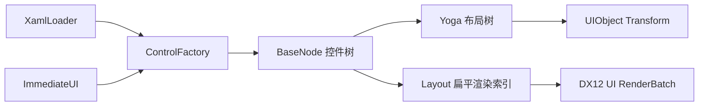

# UI 层架构

UI 层采用“多种声明前端 + 单一保留式控件树 + Yoga 布局 + D3D12 渲染适配”的结构。XAML 与 ImGui 风格 API 不是两套控件系统：二者最终都生成 `BaseNode` 控件树，因此控件、布局规则和渲染行为保持一致。



## 控件树和所有权

`BaseNode` 通过 `unique_ptr` 独占 UIObject 和子节点；`Parent`、`Root`、`TitleNode`、`ContentNode` 是非拥有观察指针。Yoga 是 C API，句柄通过 `GSL_OWNER` 标明释放责任。析构时先断开 Yoga 父子关系，再释放子树、UIObject 和 Yoga 句柄。

每个节点包含稳定 `Key`、父节点、可选 `UIObject` 和 Yoga Node。`ContentHost()` 决定声明的子控件实际进入哪里；普通容器返回自身，Panel 返回内部内容区。`Layout` 持有根节点，并生成两份非拥有索引：全部节点 `Nodes` 和可渲染对象 `UOs`。

## XAML 声明

```cpp
z8::ui::XamlLoader loader;
auto result = loader.LoadFileInto(Layout, "ui/Main.xaml");
if (!result) {
  std::cerr << result.Error << " at " << result.ErrorOffset << '\n';
}
```

当前 XAML 子集支持 `UI`、`Panel`、`Rect`，以及嵌套、自闭合标签、XML 声明、注释和常用实体。示例：

```xml
<UI Direction="Column">
  <Panel Id="inspector" Title="Inspector"
         Width="360" Height="240" TitleHeight="32" Padding="8">
    <Rect Id="properties" FlexGrow="1" Margin="4" />
  </Panel>
</UI>
```

通用属性包括 `Id/Key/Name`、`Width/Height`、`MinWidth/MinHeight`、`MaxWidth/MaxHeight`、`FlexGrow/FlexShrink`、`Margin/Padding` 和 `Direction="Row|Column"`。Panel 额外支持 `Title`、`TitleHeight`。

加载器对未知控件、未知属性、标签不匹配和不支持的文本节点返回带偏移的错误。控件创建通过 `ControlFactory` 注册；添加新控件类型不需要修改解析器：

```cpp
ControlFactory::Instance().Register("MyControl", [] {
  return std::make_unique<MyControlNode>();
});
```

当前是刻意收敛的 XAML 子集，尚不支持 XML 命名空间、属性元素、数据绑定、资源字典和文本内容。

## ImGui 风格声明

```cpp
z8::ui::ImmediateUI ui(Layout);
ui.BeginFrame();

z8::ui::UIStyle panelStyle;
panelStyle.Width = 360.0f;
panelStyle.Height = 240.0f;
panelStyle.Padding = 8.0f;

if (ui.BeginPanel("inspector", "Inspector", panelStyle)) {
  z8::ui::UIStyle row;
  row.FlexGrow = 1.0f;
  row.Margin = 4.0f;
  ui.Rect("properties", row);
  ui.EndPanel();
}

ui.EndFrame();
```

API 外观与 ImGui 相似，但内部不是每帧销毁重建。每个作用域按 `key + 控件类型 + 调用顺序` 与上一帧协调：稳定声明直接复用节点、Yoga 缓存和 UIObject；结构发生变化时，只截断第一个差异点之后的同级后缀。

XAML 的显式 Key 在整棵树中必须唯一；即时 API 的 key 必须非空且在当前同级作用域唯一。加载/声明阶段会直接拒绝冲突，避免后续查找和状态复用产生歧义。

未再次声明的控件会在 `EndFrame` 移除。Begin/End 不匹配会通过 `LastError()` 报告。

## Panel

Panel 的 Yoga 内部树固定为：

```text
Panel（可渲染背景，Column）
├── TitleNode（可渲染矩形，固定 TitleHeight）
└── ContentNode（不可渲染布局宿主，填充剩余空间）
    └── 用户声明的子控件
```

标题栏和内容区是内部节点，调用者的子控件永远被重定向到 ContentNode，不会破坏标题栏。Panel 背景和标题栏使用不同对象颜色；UI PSO 关闭深度写入并启用 alpha，保证标题栏按声明顺序覆盖背景。`Title` 已作为控件语义保存，但项目尚无字体/字形渲染器，文字显示需在文字渲染模块完成后接入。

## 布局和渲染同步

Yoga 计算 left/top/width/height 后，`Layout` 累加父偏移得到绝对像素坐标。矩形原点在中心，因此位置转换为 `(left + width/2, top + height/2)`，缩放为 `(width, height)`；UI Shader 再将像素坐标映射到 NDC 并翻转 Y。

`Layout` 仅在控件拓扑改变时设置 dirty 标记。`DX12Render` 消费该标记并重建 UI 常量缓冲和 RenderObject 索引；样式或尺寸变化只更新已有常量，不重建 GPU 资源。空 UI 批次现在可安全初始化和绘制。

## 测试

```powershell
cmake --build cmake-build-debug --target slot_ui_tests
ctest --test-dir cmake-build-debug --output-on-failure
```

测试使用 GoogleTest，按 `tests/UI/Controls`、`tests/UI/Layout`、`tests/UI/Declarative` 分类。BaseNode、RectNode、PanelNode 分别拥有独立单元测试，并覆盖所有权释放、XAML、错误诊断、即时声明复用和拓扑 dirty 状态。运行时提示、错误与警告统一使用英文。

## 后续扩展

- 为属性解析增加颜色、百分比、边级 margin/padding 和严格数值诊断。
- 增加 Text 控件、字体图集和批量字形渲染，使 Panel 标题文字可见。
- 建立 UI 专用 PSO，支持 alpha blend、scissor、z-order 和圆角。
- 增加命中测试、焦点、捕获/冒泡事件及 XAML 事件绑定。
- 对大型界面把同级协调从顺序前缀扩展为 keyed move，降低大范围重排成本。

## 关键源码

- `include/UI/Declarative`、`src/UI/Declarative`
- `include/UI/Layout/BaseNode.h`、`src/UI/Layout/BaseNode.cpp`
- `include/UI/Layout/PanelNode.h`、`src/UI/Layout/PanelNode.cpp`
- `src/UI/Layout/Layout.cpp`、`LayoutApplication.cpp`
- `src/Target/DirectX/DX12Render.cpp`、`DX12RenderBatch.cpp`
- `tests/UI/Controls`、`tests/UI/Layout`、`tests/UI/Declarative`
