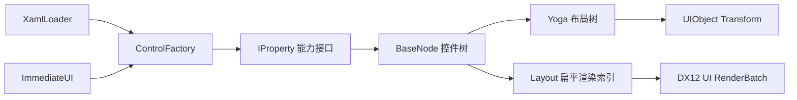

# UI 层架构

UI 层采用“多种声明前端 + 单一保留式控件树 + Yoga 布局 + D3D12 渲染适配”的结构。XAML 与 ImGui 风格 API 不是两套控件系统：二者最终都生成 `BaseNode` 控件树，因此控件、布局规则和渲染行为保持一致。



## 控件树和所有权

`BaseNode` 通过 `unique_ptr` 独占 UIObject 和子节点；`Parent`、`Root`、`TitleNode`、`ContentNode` 是非拥有观察指针。Yoga 是 C API，句柄通过 `GSL_OWNER` 标明释放责任。析构时先断开 Yoga 父子关系，再释放子树、UIObject 和 Yoga 句柄。

每个节点包含稳定 `Key`、父节点、可选 `UIObject` 和 Yoga Node。`ContentHost()` 决定声明的子控件实际进入哪里；普通容器返回自身，Panel 返回内部内容区。`Layout` 持有根节点，并生成两份非拥有索引：全部节点 `Nodes` 和可渲染对象 `UOs`。

## 属性能力接口

`BaseNode` 实现属性根接口 `IProperty`，因此 XAML、即时声明和未来检查器只需面向统一的 `SetProperty` 协议。可选行为不继续堆进一个万能基类，而是拆成 `IDraggable`、`IResizable`、`IScrollable`；控件通过多继承组合自己真正支持的能力。属性值由 `DragProperty`、`ResizeProperty`、`ScrollProperty` 保存，接口同时维护手势或范围状态。

这一区分保持三个边界：样式描述外观和盒模型，属性结构保存可序列化状态，能力接口定义控件支持的行为。Panel 同时实现三种能力；Rect 只实现通用属性接口。以后浮动工具栏可以只继承拖拽能力，列表则只继承滚动能力，无需继承 Panel。

## XAML 声明

```cpp
z8::ui::XamlLoader loader;
auto result = loader.LoadFileInto(Layout, "ui/Main.xaml");
if (!result) {
  std::cerr << result.Error << " at " << result.ErrorOffset << '\n';
}
```

当前 XAML 子集支持 `UI`、`Panel`、`Rect`，以及嵌套、自闭合标签、XML 声明、注释和常用实体。示例：

```xml
<UI Direction="Column">
  <Panel Id="inspector" Title="Inspector"
         Width="360" Height="240" TitleHeight="32" Padding="8">
    <Rect Id="properties" FlexGrow="1" Margin="4" />
  </Panel>
</UI>
```

通用属性包括 `Id/Key/Name`、`Width/Height`、`MinWidth/MinHeight`、`MaxWidth/MaxHeight`、`FlexGrow/FlexShrink`、`Margin/Padding`、`Color` 和 `Direction="Row|Column"`。`Color` 接受 `#RRGGBB`、`#RRGGBBAA` 或 `r,g,b[,a]`。

Panel 的行为属性按职责拆分为 `GetDragProperties()`、`GetResizeProperties()` 和 `GetScrollProperties()`，不再与标题、颜色和盒模型字段平铺混合。程序代码通过对应的虚拟 setter 修改；即使调用方只持有能力接口指针，也会分派回 Panel，同步 Yoga 约束和内部视口状态：

| 属性组 | XAML 属性 | 含义 |
| --- | --- | --- |
| Drag | `Draggable`/`DragEnabled` | 是否允许移动 Panel |
| Drag | `DragRegion="TitleBar\|Anywhere"` | 仅标题栏或任意内部区域可启动拖动 |
| Resize | `Resizable`/`ResizeEnabled` | 是否允许从边和角拉伸 |
| Resize | `ResizeBorder` | 拉伸命中区域宽度 |
| Scroll | `Scrollable`/`ScrollEnabled` | 滚动行为总开关 |
| Scroll | `HorizontalScrollEnabled`、`VerticalScrollEnabled` | 分方向允许滚动 |
| Scroll | `HorizontalScrollBar`、`VerticalScrollBar` | `Hidden`、`Auto` 或 `Visible` |
| Scroll | `ShowHorizontalScrollBar`、`ShowVerticalScrollBar` | 显式显示/隐藏滚动条的布尔便捷属性 |
| Scroll | `WheelStep` | 单次滚轮输入的逻辑滚动距离 |

例如：

```xml
<Panel DragRegion="Anywhere"
       Scrollable="true"
       HorizontalScrollEnabled="false"
       VerticalScrollEnabled="true"
       HorizontalScrollBar="Hidden"
       VerticalScrollBar="Auto" />
```

加载器对未知控件、未知属性、标签不匹配和不支持的文本节点返回带偏移的错误。控件创建通过 `ControlFactory` 注册；添加新控件类型不需要修改解析器：

```cpp
ControlFactory::Instance().Register("MyControl", [] {
  return std::make_unique<MyControlNode>();
});
```

当前是刻意收敛的 XAML 子集，尚不支持 XML 命名空间、属性元素、数据绑定、资源字典和文本内容。

## ImGui 风格声明

```cpp
z8::ui::ImmediateUI ui(Layout);
ui.BeginFrame();

z8::ui::UIStyle panelStyle;
panelStyle.Width = 360.0f;
panelStyle.Height = 240.0f;
panelStyle.Padding = 8.0f;

if (ui.BeginPanel("inspector", "Inspector", panelStyle)) {
  z8::ui::UIStyle row;
  row.FlexGrow = 1.0f;
  row.Margin = 4.0f;
  ui.Rect("properties", row);
  ui.EndPanel();
}

ui.EndFrame();
```

API 外观与 ImGui 相似，但内部不是每帧销毁重建。每个作用域按 `key + 控件类型 + 调用顺序` 与上一帧协调：稳定声明直接复用节点、Yoga 缓存和 UIObject；结构发生变化时，只截断第一个差异点之后的同级后缀。

XAML 的显式 Key 在整棵树中必须唯一；即时 API 的 key 必须非空且在当前同级作用域唯一。加载/声明阶段会直接拒绝冲突，避免后续查找和状态复用产生歧义。

未再次声明的控件会在 `EndFrame` 移除。Begin/End 不匹配会通过 `LastError()` 报告。

## Panel

Panel 的 Yoga 内部树固定为：

```text
Panel（可渲染背景，Column）
├── TitleNode（可渲染矩形，固定 TitleHeight）
├── ScrollViewportNode（填充剩余空间并裁剪）
│   └── ContentNode（按内容自然尺寸增长）
│       └── 用户声明的子控件
└── VerticalScrollBarNode（绝对定位的独立复合控件）
    └── ThumbNode
```

标题栏、视口和滚动条是内部节点，调用者的子控件永远被重定向到 ContentNode，不会破坏复合控件结构。Panel 背景和标题栏使用不同对象颜色；UI PSO 关闭深度写入并启用 alpha，保证标题栏按声明顺序覆盖背景。`Title` 已作为控件语义保存，但项目尚无字体/字形渲染器，文字显示需在文字渲染模块完成后接入。

Panel 默认允许拖动和缩放。左键拖动标题栏会把当前流式布局结果固化成 Yoga 绝对定位，随后更新 `left/top`；边缘和四角各有默认 6 像素的缩放命中区。指针位于边界时会显示对应的水平、垂直或对角系统缩放光标。缩放默认限制为 240×160，`MinWidth/MinHeight` 会同时更新交互限制和 Yoga 约束。可通过 `Draggable="false"`、`Resizable="false"` 或 `ResizeBorder` 调整行为。

默认 `Drag.Region` 为 `TitleBar`。默认滚动总开关开启，仅允许垂直方向；水平滚动条为 `Hidden`，垂直滚动条为 `Auto`，滚轮步长为 40。Panel 根据内容范围计算并夹紧偏移；滚轮移动内容，轨道点击按一页移动，滑块拖拽通过指针捕获连续更新 value。`ScrollBarNode` 只管理 range/value 和滑块，不拥有内容，因而可被后续独立 ScrollView、列表和水平滚动复用。

视口裁剪不会为每个子项反复切换 D3D12 scissor。布局遍历把父子裁剪矩形求交后写入每个 `UIObject` 常量，像素着色器在视口外丢弃像素；命中测试使用同一裁剪矩形，因此不可见内容也不会接收事件。这个方案优先保证当前逐对象渲染结构下的一致性，未来批处理器可再按相同 clip 合批并切换硬件 scissor。

## 与 Unity / Unreal 的架构对应

当前设计采用两者共有的保留式、组合式思路，而不是复制引擎 API：

- 与 Unity UI Toolkit 类似，稳定视觉树负责控件所有权，Yoga/Flexbox 负责布局，样式、事件和渲染各自保持边界；ScrollView 明确拆成 viewport、content container 和 scroller。
- 与 Unreal Slate 类似，复杂控件由较小控件组合，属性与事件通过窄接口连接；滚动条消费经过夹紧的 offset/range，不反向依赖内容控件类型。
- Slot 保留 XAML 和即时声明两个前端，但二者只协调同一棵 `BaseNode` 树，运行时状态不会因为声明方式不同而分叉。

下一阶段适合在现有边界上增加属性元数据（类型、默认值、序列化名）、伪状态样式、焦点/键盘导航和布局/绘制失效标记，而不是继续扩充 Panel 的职责。

`Layout` 使用与渲染相同的绝对布局框做逆绘制顺序命中，事件从视觉目标向父节点冒泡。处理手势的节点会被捕获至鼠标抬起，因此指针移出 Panel 后拖动仍连续；命中 UI 的事件不会继续影响背后的相机或场景对象。

## 默认主题

`UITheme::Modern()` 集中保存各类控件的默认盒模型和颜色，控件构造时应用主题，XAML 或 Immediate UI 属性随后覆盖。当前现代深色主题采用低饱和蓝灰色：Rect 默认外边距 4、最小尺寸 24×24；Panel 默认外边距 8、最小尺寸 240×160、标题栏高度 36、内容内边距 10，并统一滚动轨道、滑块、厚度和最小滑块长度。Panel 的背景、标题栏和普通 Rect 使用分层颜色，内部复合节点会清除普通 Rect 外边距以保持几何贴合。

新增控件应先在 `UITheme` 中定义该控件的 `UIControlTheme`，再在构造函数统一应用 `Color`、`Margin`、`Padding` 和最小尺寸，避免重新引入散落的魔法值。实例属性始终拥有更高优先级。

## 布局和渲染同步

Yoga 计算 left/top/width/height 后，`Layout` 累加父偏移得到绝对像素坐标。矩形原点在中心，因此位置转换为 `(left + width/2, top + height/2)`，缩放为 `(width, height)`；UI Shader 再将像素坐标映射到 NDC 并翻转 Y。

`Layout` 仅在控件拓扑改变时设置 dirty 标记。`DX12Render` 消费该标记并重建 UI 常量缓冲和 RenderObject 索引；样式或尺寸变化只更新已有常量，不重建 GPU 资源。空 UI 批次现在可安全初始化和绘制。

## 测试

```powershell
cmake --build cmake-build-debug --target slot_ui_tests
ctest --test-dir cmake-build-debug --output-on-failure
```

测试使用 GoogleTest，按 `tests/UI/Controls`、`tests/UI/Layout`、`tests/UI/Declarative` 分类。BaseNode、RectNode、PanelNode 分别拥有独立单元测试，并覆盖属性接口发现、所有权释放、XAML、错误诊断、即时声明复用、拓扑 dirty 状态、Panel 拖动、角落缩放、缩放光标、滚轮偏移、滚动条可见性、视口裁剪、最小尺寸限制和统一颜色覆盖。运行时提示、错误与警告统一使用英文。

## 后续扩展

- 为属性解析增加颜色、百分比、边级 margin/padding 和严格数值诊断。
- 增加 Text 控件、字体图集和批量字形渲染，使 Panel 标题文字可见。
- 建立 UI 专用 PSO，支持 alpha blend、scissor、z-order 和圆角。
- 增加键盘焦点、Tab 导航、悬停/光标反馈及 XAML 事件绑定。
- 对大型界面把同级协调从顺序前缀扩展为 keyed move，降低大范围重排成本。

## 关键源码

- `include/UI/Declarative`、`src/UI/Declarative`
- `include/UI/Layout/BaseNode.h`、`src/UI/Layout/BaseNode.cpp`
- `include/UI/Layout/PanelNode.h`、`src/UI/Layout/PanelNode.cpp`
- `include/UI/Layout/ScrollBarNode.h`、`src/UI/Layout/ScrollBarNode.cpp`
- `include/UI/Property/IProperty.h`、`IDraggable.h`、`IResizable.h`、`IScrollable.h`
- `include/UI/Style/UITheme.h`
- `src/UI/Layout/Layout.cpp`、`LayoutApplication.cpp`
- `src/Target/DirectX/DX12Render.cpp`、`DX12RenderBatch.cpp`
- `tests/UI/Controls`、`tests/UI/Layout`、`tests/UI/Declarative`
